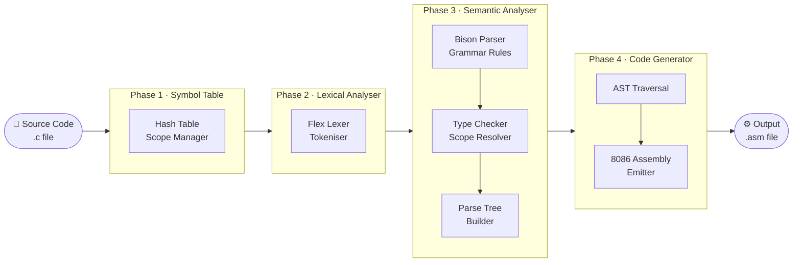
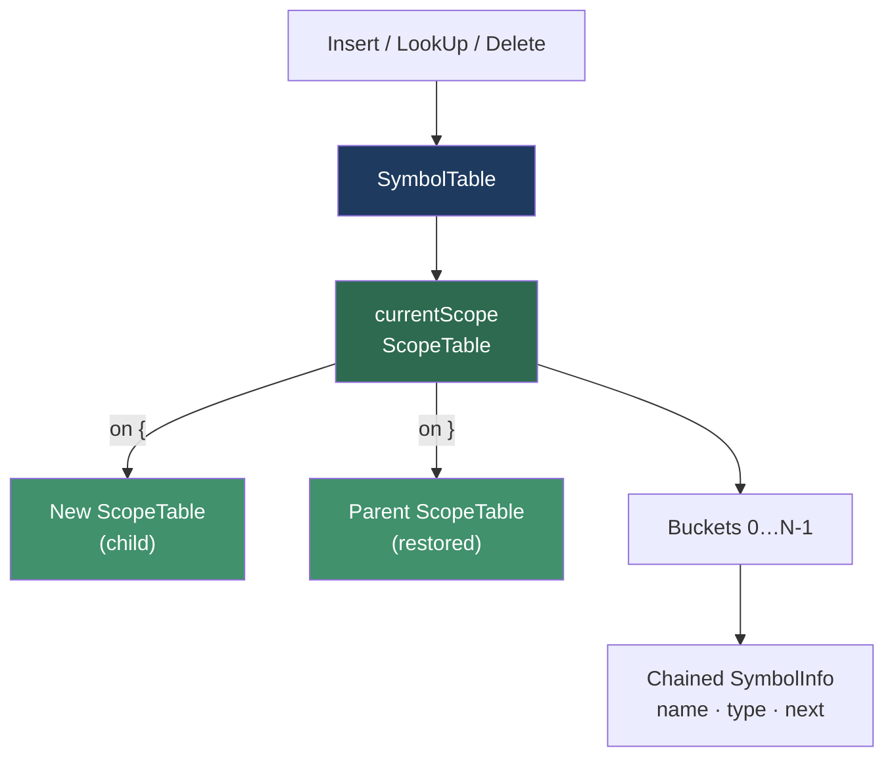
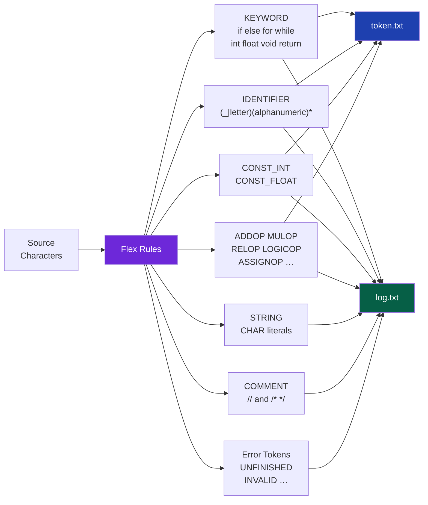
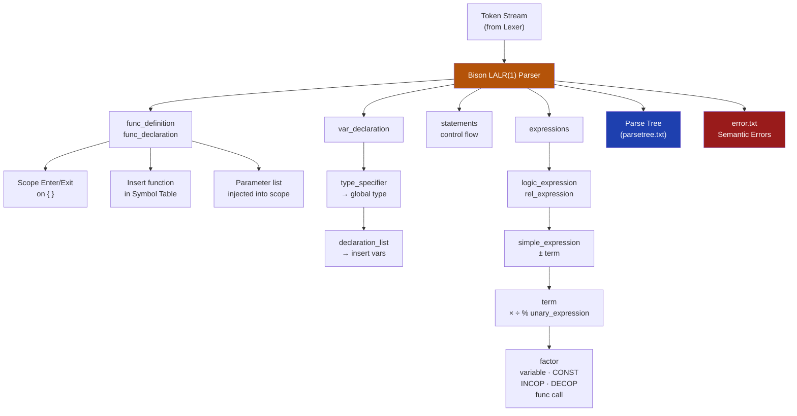
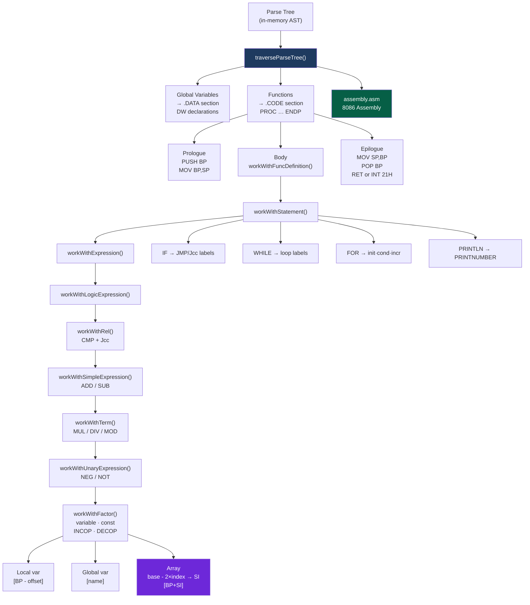
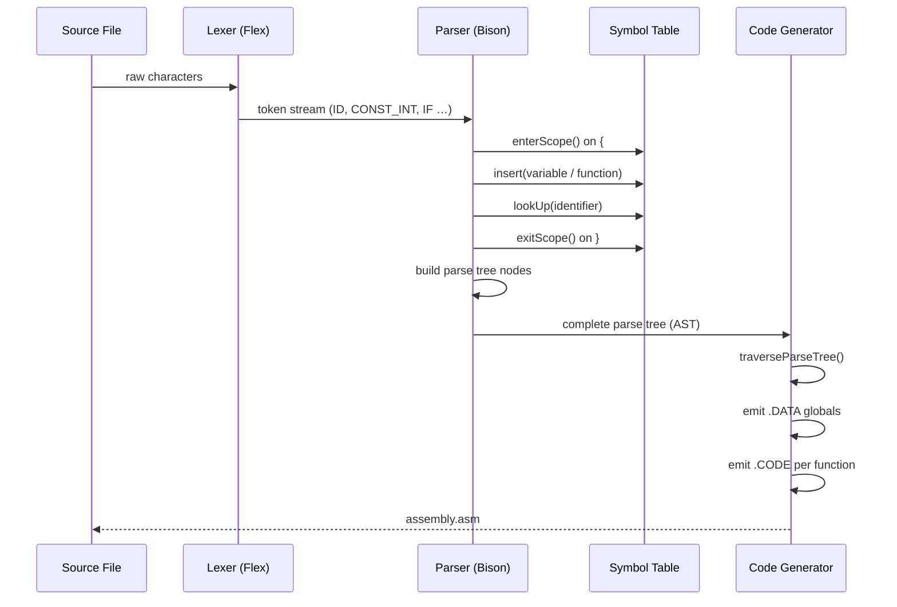

# CSE 310 — Mini Compiler

A mini C compiler built from scratch in four phases: **Symbol Table → Lexical Analysis → Semantic Analysis → Intermediate Code Generation** (8086 Assembly).

---

## Pipeline Overview



---

## Architecture — Deep Dive

### Symbol Table



Each scope is a **hash table** using the SDBM hash function. Scopes are chained as a linked list — entering `{` pushes a new scope, `}` pops it. Lookup walks from innermost to outermost scope.

---

### Lexical Analysis



- Outputs **token.txt** (token stream) and **log.txt** (detailed trace + errors)
- Handles multi-line strings, escape sequences, single/multi-line comments
- Tracks line numbers for all error messages

---

### Semantic Analysis (Parser + Type Checker)



---

### Intermediate Code Generation (8086 Assembly)



---

## Supported Language Features

| Feature | Supported |
|---------|-----------|
| `int`, `float`, `void` types | ✅ |
| Global & local variables | ✅ |
| 1-D arrays | ✅ |
| Arithmetic `+ - * / %` | ✅ |
| Relational `< > <= >= == !=` | ✅ |
| Logical `&& \|\|` and `!` | ✅ |
| `++` / `--` (postfix) | ✅ |
| `if` / `if-else` | ✅ |
| `while` loop | ✅ |
| `for` loop | ✅ |
| Function declaration & definition | ✅ |
| `return` statement | ✅ |
| `println(var)` (built-in print) | ✅ |
| Nested scopes | ✅ |
| Single & multi-line comments | ✅ (Lexer) |

---

## Project Structure

```
CSE_310-Compiler/
│
├── Symbol Table/
│   ├── 2005046.cpp        # Standalone symbol table with SDBM hash
│   └── input.txt          # Test commands (I/L/D/S/E/P/Q)
│
├── Lexical Analyser/
│   ├── 2005046.l          # Flex rules → token.txt + log.txt
│   ├── Makefile
│   └── input.txt
│
├── Sementic Analyser/
│   ├── 2005046.l          # Flex rules (feeds Bison)
│   ├── 2005046.y          # Bison grammar + type checker
│   ├── SymbolInfo.h       # SymbolInfo · ScopeTable · SymbolTable
│   ├── run.sh
│   └── input.c
│
└── Intermediate Code Generation/
    ├── 2005046.l          # Flex rules (feeds Bison)
    ├── 2005046.y          # Bison grammar + 8086 assembly emitter
    ├── SymbolInfo.h       # Extended SymbolInfo (global/array/offset fields)
    ├── run.sh
    └── input.c
```

---

## How to Build & Run

> **Prerequisites:** `flex`, `bison` (provides `yacc`), `g++`, `make`
>
> Install on Ubuntu/Debian:
> `sudo apt update && sudo apt install -y flex bison g++ make`
>
> Verify:
> `flex --version && bison --version && yacc --version && g++ --version`

### Run All Phases (End-to-End)

```bash
cd CSE_310-Compiler

# Phase 1
cd "Symbol Table" && g++ -o symtable 2005046.cpp && ./symtable < input.txt && cd ..

# Phase 2
cd "Lexical Analyser" && make && ./a.out input.txt && cd ..

# Phase 3
cd "Sementic Analyser" && bash run.sh && cd ..

# Phase 4
cd "Intermediate Code Generation" && bash run.sh && cd ..
```

---

### Phase 1 — Symbol Table

```bash
cd "Symbol Table"
g++ -o symtable 2005046.cpp
./symtable < input.txt
```

**Input commands** (`input.txt`):

| Command | Action |
|---------|--------|
| `I name type` | Insert symbol |
| `L name` | Look up symbol |
| `D name` | Delete from current scope |
| `S` | Enter new scope |
| `E` | Exit current scope |
| `P C` | Print current scope table |
| `P A` | Print all scope tables |
| `Q` | Quit |

---

### Phase 2 — Lexical Analyser

```bash
cd "Lexical Analyser"
make
./a.out input.txt
# Outputs: token.txt  log.txt
```

---

### Phase 3 — Semantic Analyser

```bash
cd "Sementic Analyser"
bash run.sh
# Outputs: log.txt  parsetree.txt  error.txt
```

Or manually:

```bash
bison -d -y 2005046.y
g++ -w -c -o y.o y.tab.c
flex 2005046.l
g++ -w -c -o l.o lex.yy.c
g++ y.o l.o -lfl -o parser
./parser input.c
```

---

### Phase 4 — Intermediate Code Generation

```bash
cd "Intermediate Code Generation"
bash run.sh
# Outputs: log.txt  parseTree.txt  assembly.asm
```

Or manually:

```bash
bison -d -y 2005046.y
g++ -w -c -o y.o y.tab.c
flex 2005046.l
g++ -w -c -o l.o lex.yy.c
g++ y.o l.o -lfl -o simplecalc
./simplecalc input.c log.txt parseTree.txt assembly.asm
```

The generated `assembly.asm` targets **8086** (DOS, MASM-compatible). Run it with DOSBox + MASM/TASM or any 8086 assembler/emulator.

> Note: `run.sh` in Intermediate Code Generation uses fail-fast mode (`set -euo pipefail`), so it stops immediately on build/run errors instead of continuing with broken artifacts.

---

## Example

**Input (`input.c`)**:

```c
int x, y, z;

int var(int a, int b) {
    return a + b;
}

void foo() {
    x = 2;
    y = x - 5;
}

int main() {
    int a[2], c, i, j;
    a[1] = 5;
    i = a[0] + a[1];
    j = 2 * 3 + (5 % 3 < 4 && 8) || 2;
    return 0;
}
```

**Generated assembly (excerpt)**:

```asm
.MODEL SMALL
.STACK 1000H
.DATA
    CR EQU 0DH
    LF EQU 0AH
    NUMBER DB "00000$"
    x DW 1 DUP (0000H)
    y DW 1 DUP (0000H)
    z DW 1 DUP (0000H)
.CODE
main PROC
    MOV AX, @DATA
    MOV DS, AX
    PUSH BP
    MOV BP, SP
    SUB SP, 4       ; a[2]
    SUB SP, 2       ; c
    SUB SP, 2       ; i
    SUB SP, 2       ; j
    MOV AX, 5
    PUSH AX
    MOV AX, 2
    NEG AX
    ADD AX, -2      ; base - 2*index for a[1]
    MOV SI, AX
    POP AX
    MOV [BP+SI], AX
    MOV SP, BP
    POP BP
    MOV AX, 4CH
    INT 21H
main ENDP
```

---

## Data Flow Summary



---

## Implementation Notes

- **Hash function:** SDBM (`hash = c + (hash<<6) + (hash<<16) - hash`) for symbol name hashing
- **Parser:** LALR(1) generated by Bison with `%nonassoc LOWER_THAN_ELSE` to resolve the dangling-else ambiguity
- **Local variables:** Tracked via `dummySymbolTable<name, BP-offset>`. Each variable is 2 bytes; arrays use `base - 2×index` addressing with the `SI` register (`[BP+SI]`)
- **Global variables:** Declared in the `.DATA` segment, accessed by name directly
- **Function calls:** `CALL funcname` with caller-save registers; return value in `AX`
- **Print:** Built-in `PRINTNUMBER` and `NEWLINE` procedures appended to each function

---

*Course: CSE 310 — Compiler Design | Student ID: 2005046*
