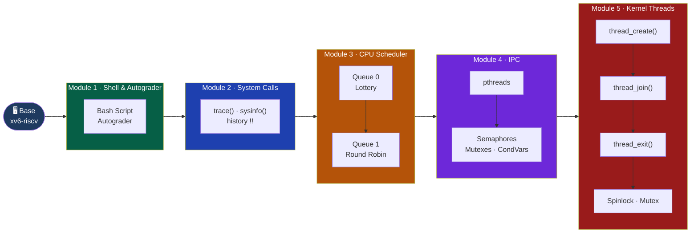
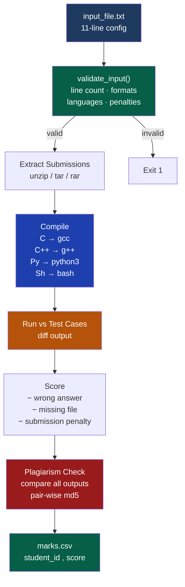
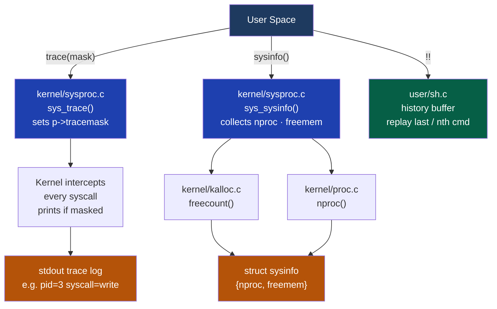
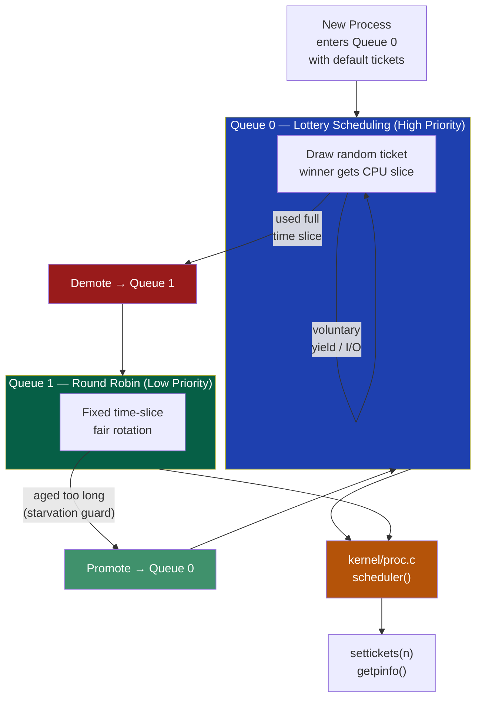
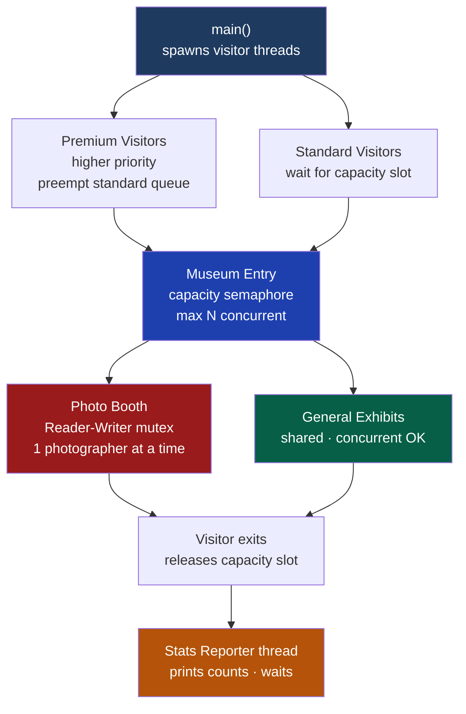
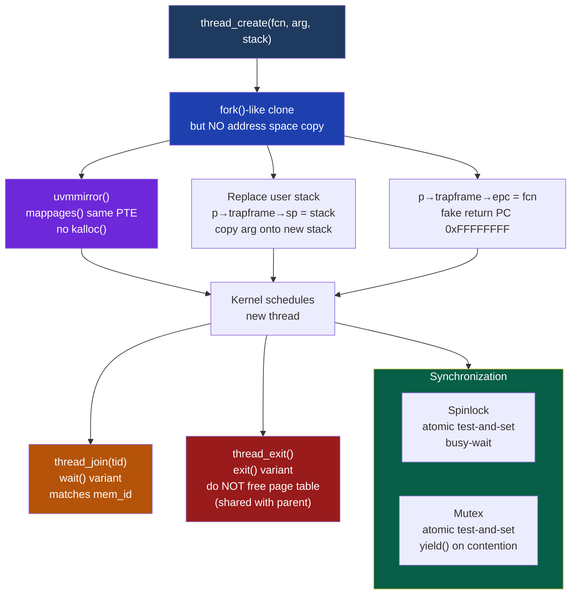
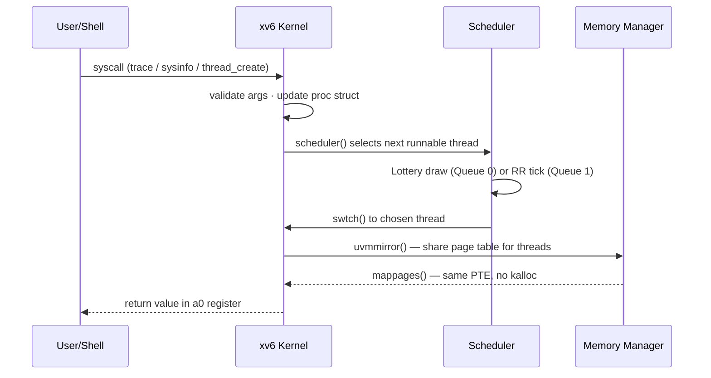

# CSE 314 — Operating Systems (xv6-riscv)

A series of five OS modules built on top of the MIT **xv6-riscv** kernel, progressively extending it from shell tooling all the way to kernel-level threading.

---

## Module Overview



---

## Module 1 — Shell Scripting & Autograder

A fully automated grading system written in Bash. It validates, extracts, compiles, runs and scores any number of student submissions and produces a CSV report.



**Config file format (`input_file.txt`):**

| Line | Value |
|------|-------|
| 1 | `true` / `false` — archive mode |
| 2 | Allowed archive formats (`zip rar tar`) |
| 3 | Allowed source languages (`c cpp py sh`) |
| 4–11 | Penalty and test-case settings |

**Run:**
```bash
cd "Offline1(Shell-Autograder)"
bash Offline1_2005046.sh -i input_file.txt
```

---

## Module 2 — System Calls

Three new kernel interfaces added to xv6, mirroring Linux tracing and monitoring utilities.



**Apply & run:**
```bash
git clone https://github.com/mit-pdos/xv6-riscv.git
cd xv6-riscv
git apply ../Offline2\(System-call\)/Offline2_2005046.patch
make qemu
```

---

## Module 3 — CPU Scheduler (MLFQ + Lottery)

The default Round-Robin scheduler is replaced with a **two-level Multi-Level Feedback Queue**. Queue 0 uses probabilistic Lottery Scheduling; Queue 1 falls back to Round Robin.



| System Call | Purpose |
|-------------|---------|
| `settickets(int n)` | Assign `n` lottery tickets to the calling process |
| `getpinfo(struct pstat*)` | Dump scheduler stats (queue, ticks, tickets) for all processes |

**Apply & run:**
```bash
git apply ../Offline3\(Kernel-Scheduler\)/Offline3_2005046.patch
make qemu
```

---

## Module 4 — Inter-Process Communication (IPC)

A **Museum Visit** concurrency simulation solved with POSIX threads, semaphores, mutexes and condition variables. Demonstrates Reader-Writer variants and deadlock-free synchronization.



**Synchronization primitives used:**

| Primitive | Role |
|-----------|------|
| `sem_t` (semaphore) | Museum capacity limit |
| `pthread_mutex_t` | Photo booth exclusion |
| `pthread_cond_t` | Priority queuing for premium visitors |
| `pthread_barrier_t` | All threads ready before simulation starts |

**Build & run:**
```bash
cd "Offline4(IPC)"
unzip 2005046.zip
g++ -pthread -o museum museum.c
./museum <visitors> <capacity>
```

---

## Module 5 — Kernel-Level Threads & Synchronization

Thread support and synchronization primitives implemented **inside the xv6 kernel**. Threads share the parent's page table via `uvmmirror()` (no new physical pages allocated).



**Key `struct proc` additions:**

```c
struct proc {
    // ... existing fields ...
    struct spinlock memlock;  // guard shared page table
    int is_thread;            // 1 if this proc is a thread
    int mem_id;               // all threads of same process share this ID
};
```

**Apply & run:**
```bash
git apply ../Offline5\(Threading\)/Offline5_2005046.patch
make qemu
# In xv6 shell:
$ threads
```

---

## Supported Features

| Feature | Module | Implemented |
|---------|--------|-------------|
| Bash autograder (multi-language) | 1 | ✅ |
| Plagiarism detection | 1 | ✅ |
| `trace()` syscall (strace-like) | 2 | ✅ |
| `sysinfo()` — nproc / freemem | 2 | ✅ |
| Shell history `!!` | 2 | ✅ |
| Lottery Scheduling (Queue 0) | 3 | ✅ |
| Round-Robin (Queue 1) | 3 | ✅ |
| MLFQ promotion / demotion | 3 | ✅ |
| Aging (starvation prevention) | 3 | ✅ |
| `settickets` / `getpinfo` | 3 | ✅ |
| POSIX thread Museum simulation | 4 | ✅ |
| Priority visitor queuing | 4 | ✅ |
| Deadlock-free semaphore design | 4 | ✅ |
| `thread_create/join/exit` | 5 | ✅ |
| Shared address space (`uvmmirror`) | 5 | ✅ |
| Page table sync across threads | 5 | ✅ |
| User-space Spinlock | 5 | ✅ |
| User-space Mutex (sleeping lock) | 5 | ✅ |

---

## Project Structure

```
CSE-314-Operating-System/
│
├── Offline1(Shell-Autograder)/
│   ├── Offline1_2005046.sh      # Autograder script
│   └── Offline1_test-cases.zip
│
├── Offline2(System-call)/
│   └── Offline2_2005046.patch   # trace · sysinfo · history
│
├── Offline3(Kernel-Scheduler)/
│   └── Offline3_2005046.patch   # MLFQ · Lottery · RR · aging
│
├── Offline4(IPC)/
│   └── 2005046.zip              # Museum simulation (pthreads)
│
├── Offline5(Threading)/
│   ├── Offline5_2005046.patch   # Kernel threads · spinlock · mutex
│   └── Offline_5_Threading.md  # Assignment spec
│
└── Resources/
    ├── book-riscv-rev1.pdf      # xv6 RISC-V book
    └── Shell_Commands_Sept4Update.pdf
```

---

## How to Build & Run

> **Prerequisites:** `gcc-riscv64-linux-gnu`, `qemu-system-misc`, `make`
>
> Install on Ubuntu/Debian:
> ```bash
> sudo apt install gcc-riscv64-linux-gnu qemu-system-misc make
> ```

### Applying Any Patch (Modules 2–5)

```bash
git clone https://github.com/mit-pdos/xv6-riscv.git
cd xv6-riscv
git apply /path/to/OfflineN_2005046.patch
make qemu
```

### Module 1 — Autograder only

```bash
cd "Offline1(Shell-Autograder)"
bash Offline1_2005046.sh -i input_file.txt
```

---

## Data Flow Summary



---

*Course: CSE 314 — Operating Systems | Student ID: 2005046*
